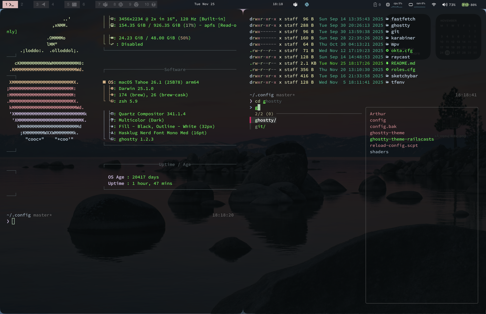

# macOS Dotfiles

A collection of configuration files for my macOS setup, managed with Git.



## 🛠 Configuration Included

### Window Management & Status Bar
- **[Aerospace](https://github.com/nikitabobko/AeroSpace)**: Tiling window manager configuration (`.config/aerospace/`).
  - Custom workspace scripts.
  - Gaps and focus management.
- **[SketchyBar](https://github.com/FelixKratz/SketchyBar)**: Highly customizable status bar (`.config/sketchybar/`).
  - Custom Lua configuration.
  - Dynamic workspace indicators with pastel colors.
  - Widgets: CPU, RAM, Battery, Volume, WiFi (with WAN IP), Brew updates.

### Terminal & Shell
- **Zsh**: Shell configuration (`.zshrc`, `.zprofile`, `.zshenv`).
  - **Powerlevel10k**: Theme configuration (`.p10k.zsh`).
  - **Modern CLI tools**: bat (cat), eza (ls), atuin (history), direnv (env management), zoxide (cd).
- **[WezTerm](https://wezfurlong.org/wezterm/)**: Primary terminal emulator (`.config/wezterm/`).
  - Zellij integration keybindings.
- **[Ghostty](https://ghostty.org/)**: Alternative terminal emulator (`.config/ghostty/`).
  - Custom shaders and themes.
- **[Zellij](https://zellij.dev/)**: Terminal multiplexer (`.config/zellij/`).
  - Session management with custom aliases (`zm`, `tml`, `tmk`).
  - Locked mode by default for seamless shell usage.
  - 3-tab project layout (shell, claude, nvim).
- **Fastfetch**: System information fetch tool (`.config/fastfetch/`).
- **Git**: Global git configuration (`.config/git/`).

### Utilities
- **Raycast**: Productivity tool extensions and scripts (`.config/raycast/`).
- **[Karabiner-Elements](https://karabiner-elements.pqrs.org/)**: Keyboard customization (`.config/karabiner/`).
  - Fn ↔ Control swap for ergonomic Ctrl access.
  - Caps Lock: Hold=Option, Tap=Escape.
  - Right Command → Control.
  - Aerospace workspace hotkeys via shell commands.

## ⌨️ Keybindings

Quick access to keyboard shortcuts:
- [Karabiner keybindings](.config/KEYBINDINGS.md#%EF%B8%8F-karabiner-elements-key-remapping) - Physical key remapping, modifier setup
- [Shell (Zsh) keybindings](.config/KEYBINDINGS.md#-shell-zsh---emacs-mode) - Terminal navigation, history, editing
- [Aerospace keybindings](.config/KEYBINDINGS.md#-aerospace-window-manager) - Window management, workspaces, layouts
- [WezTerm keybindings](.config/KEYBINDINGS.md#-wezterm-terminal-emulator) - Terminal emulator shortcuts
- [Zellij keybindings](.config/KEYBINDINGS.md#-zellij-terminal-multiplexer) - Session management, tab/pane navigation
- [NvChad keybindings](.config/KEYBINDINGS.md#-nvchad-neovim) - Neovim editor shortcuts

Full reference: [.config/KEYBINDINGS.md](.config/KEYBINDINGS.md)

## 🚀 Setup

1. **Clone the repository:**
   ```bash
   git clone git@github.com:xajler/mac-dotfiles.git ~/mac-dotfiles
   # Or if you are cloning directly to home (be careful with existing files):
   # git init
   # git remote add origin ...
   # git pull origin master
   ```

2. **Secrets Management:**


   Create or copy `.zsh.env` file for private aliases and secrets (ignored by git):

   Secrets are stored in macOS Keychain for security. See [Security](#-security) section below.

   *Note: `.zsh.env` is gitignored to keep your private settings safe.*

## 📂 Structure

- `.config/`: Application configurations.
- `.zshrc`: Main shell configuration with Keychain integration.
- `.zsh.env`: Private aliases and settings (not tracked).
- `.gitignore`: Custom ignore rules for dotfiles management.

## 🔐 Security

Sensitive data (API tokens, credentials) is stored in macOS Keychain, not in plain text files. The `.zsh.env` file loads these secrets on shell startup.

### Adding Secrets to Keychain

To store a new secret:
```bash
security add-generic-password -a "$USER" -s "SECRET_NAME" -w "your-secret-value"
```

Then add to your `.zsh.env`:
```bash
export SECRET_NAME=$(security find-generic-password -a "$USER" -s "SECRET_NAME" -w 2>/dev/null)
```

**Benefits:**
- Secrets encrypted by macOS Keychain
- No plain text tokens in dotfiles
- Safe to commit `.zshrc` to public repos
- Private settings stay in gitignored `.zsh.env`

## 📝 License

[GPLv3](LICENSE)

